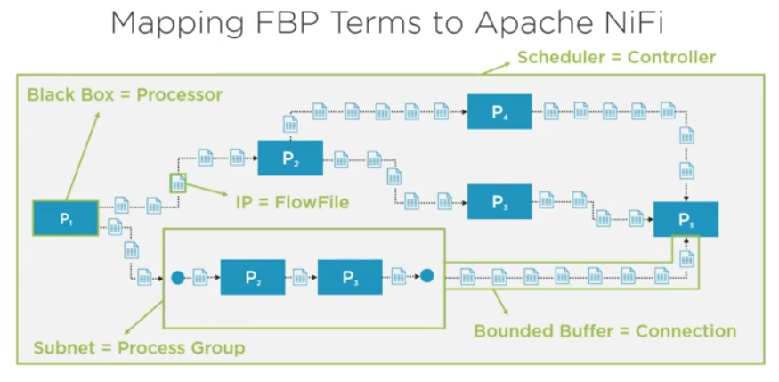
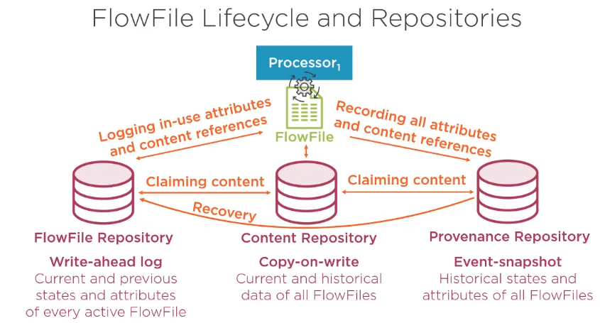

# Apache NiFi(Niagara Files)

- Four key data challenges
  - Volume 
    - amount of data
    - integrtin, sorting, processing and managing
  - Velocity 
    - Integating data streams and events
    - adapting to rate changes
    - combining batch and streaming data sets
    - queuing/buffering and functionality 
  - Variety
    - Data coming from various data sources
    - Handling various data structures
      - structured
      - semi structured
      - unstructures
  - Veracity
    - Reliability of a data source and its processing steps
- Patterns of data integration
  - Batch 
  - stream
- Apache Nifi Key features
  - Flow Management
  - Push and pull models
  - Ease of Use
  - Data provenance
  - Security
  - Extensible architecture
  - Flexible in scaling

- Data Flow Management
  - Guaranteed delivery
  - Data Buffering and pressure release
  - Priortized queuing
  - Quality of service
- How does NiFi achieve tackling data challenges
  - Volume
    - Cluster setup (horizontal scaling(scale out))
    - Parallelism (parallel execution)(scale up)
    - Custom setting
  - Velocity
    - Asynchrony
    - Data buffering
    - memory usage
  - Variety
    - pre-built components
    - custom components
    - many default formats
  - Veracity
    - Tracking and Cleansing
    - Repositories
    - Guaranteed delivery
- Nifi as a dataflow system
  - Good For
    - Stream Processing
    - Data transfer and delivery
    - Handling data in motion
    - Routing, filtering and transforming
  - Not Good for
    - Batch processing
    - Distributed computation
    - Handling huge bulks of data
    - Complex event processing , joins and rolling window operations

- # NiFi core concepts
  - Flow-Based Programming(FBP)
    - component-oriented
    - independent and reusable black boxes
    - endless reconnection
    - Exchanging Information Packets constituting a stream
    - Generated and consumed asynchronously
    - FBP IncreasesDevelopment agility, scalability and availability
    - 
  - NiFi main components
    - FlowFile - the heart of NiFi  
      - created when producer /consumer invoke a file 
      - creation and adding content
      - Datachunk moving through the system
      - Flow file is actually immutable
      - Attributes
        - System and user-defined attributes
        - MetaData in key/value pairs
      - COntent
        - Pointing to actual data
        - Data is stored in content repository
    - Processor
      - Configurable component written in java
      - Accessing attributes and content of flowFiles and performing operation
      - High-lvel abstraction fulfilling a task
      - Development of custom processors
      - Individual scaling on process
    - Process Groups
      - Grouping and nesting processors and their connections
      - Interacting with other layers
      - Defining input and output ports
      - Benifitial in maintaining flows
    - Connections
      - Connecting processors and process groups
      - Queuing and buffering between processors
      - Defining threshold and applying backpressure
      - Prioritizing FlowFiles(default FIFO)
    - Controller
      - Managing dataflow
      - keeping record of all applied components
      - Allocating and managing threads
      - Adding services for sharing resources among processors
        - database connections
        - SSL certificates
    - ### FlowFIle Lifecycle and Repository
      - Flowfile Repository
      - Content Repository
      - Provenance Repository
      - 

    > Look into Apache-MiNiFi
    
    - Controller services
      - Services shared by components
      - Avoids redundancy
      - Running encapsulated 
      - pre-built and custom controller service
      - Ex :- Providing connections and credentials , sending reports, predefined formatting

  - ## Apache NiFi monitoring system
    - Two types of Monitoring
      - Nifi Service Monitoring
        - Service status information
        - Metrics about system resource etc 
        - Notification service
        - Reporting tasks
      - DataFlow Monitoring 
        - Based on Monitoring driven development(MDD)
        - Metrics about flow file , queues etc
        - Flow Integration
        - S2S Reporting tasks ,Moniroting activity
    - Inbuilt monitorings
      - Summary
      - Counters
      - Bulletin Boards
      - Data provenance